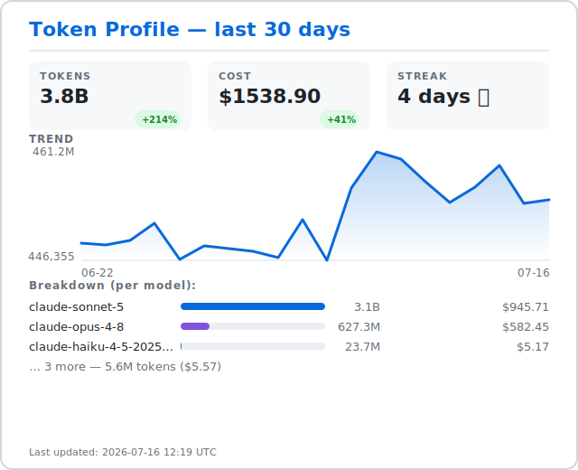

  <a href="https://commit-history.com/Christophe1997">
    <picture>
      <source media="(prefers-color-scheme: dark)" srcset="https://commit-history.com/embed/Christophe1997?theme=dark" />
      
    </picture>
  </a>

## Hi there 👋

<!-- token-profile:start -->

Token Profile — Tokens: 3.9B (+237%)   Cost: $1587.14 (+50%)   Streak: 5 days

<picture><source media="(prefers-color-scheme: dark)" srcset=".token-profile/card-dark.svg"></picture>

Generated by [token-profile](https://github.com/Christophe1997/token-profile)

<!-- token-profile:end -->
